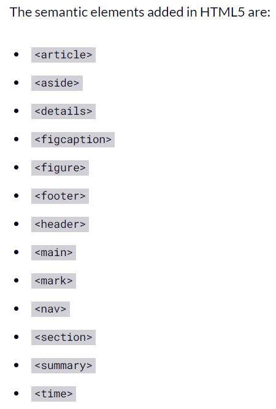

# HTML

## HTML (HyperText Markup Language)

HTML is the Web's most fundamental building element (HyperText Markup Language). It defines the online content's meaning and organization. Additional technology, other than HTML, is usually utilized to describe the appearance/presentation of a web page (JavaScript) (CSS).

## What are the attributes and tags?
HTML is based on tags and attributes.
They work together, but they have various functions: two minutes to differentiate the two are worth investing.
They work together, but they have various functions: two minutes to differentiate the two are worth investing.

## What Are Tags for HTML?
Tags are generally included in an angle brackets to denote the start of the HTML element. An example of a tag is <h1>.
In order for most tags to work, <h1> must be opened and </h1> closed.

## What are the Attributes for HTML?
Additional information is contained in the attributes. Attributes are an opening tag and further information is within.
An example of a characteristic is: < img src="mydog.jpg" alt="A photo of my dog." > . But without leaving a space before and after Angle brackets.

## This is some HTML semantic : 

For more info : [HTML Semantic](https://www.freecodecamp.org/news/semantic-html5-elements/)

## Hypertext : 

refers to connections between websites, either on one website or between websites. Links are a key part of the Web. You become an active participant in the World Wide Web by posting content onto the Internet and linking it to other people's produced pages.

## Wireframing :

UX designers are employed to define and update knowledge depending on the website, application, or product design in wireframing. This method focuses on whether the user requires the designer or customer to process the data on a site on the basis of UX's user research.

## Wireframes html
Creating wireframes in the browser is a wonderful concept and I am pleased to agree that intelligent people such as Matt Griffin will. Here are some of the several advantages of HTML wireframing :

1. They get into the browser quicker
2. They reinforce the notion that you’re creating a website
3. They’re interactive
4. They allow for living, breathing annotations